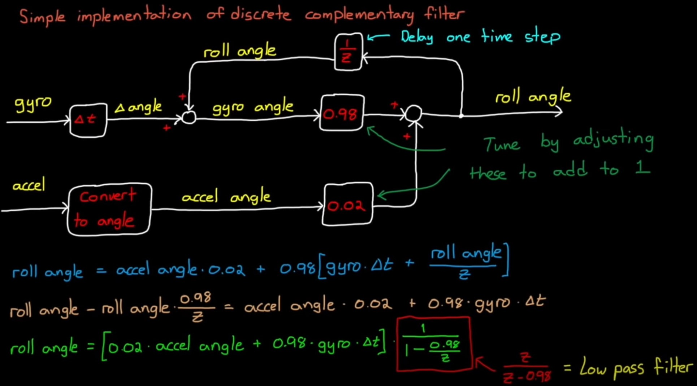
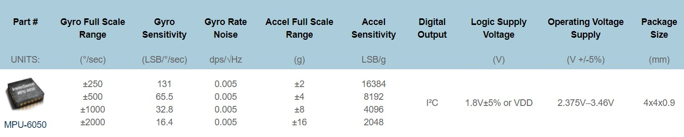
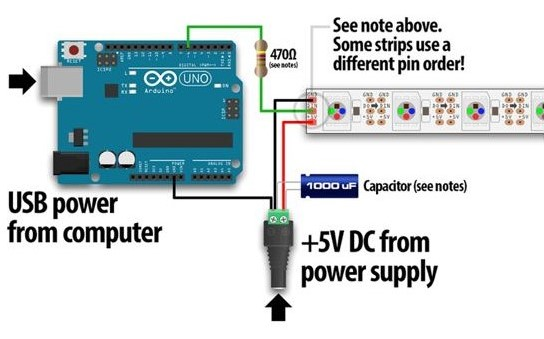
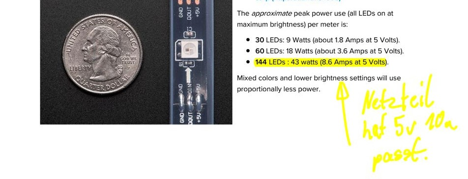
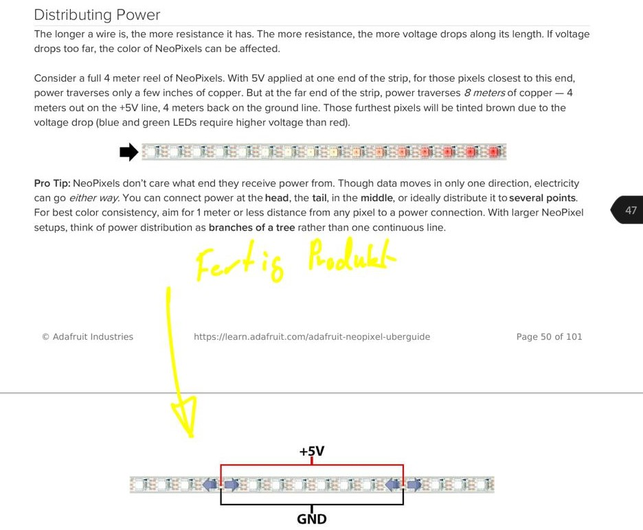
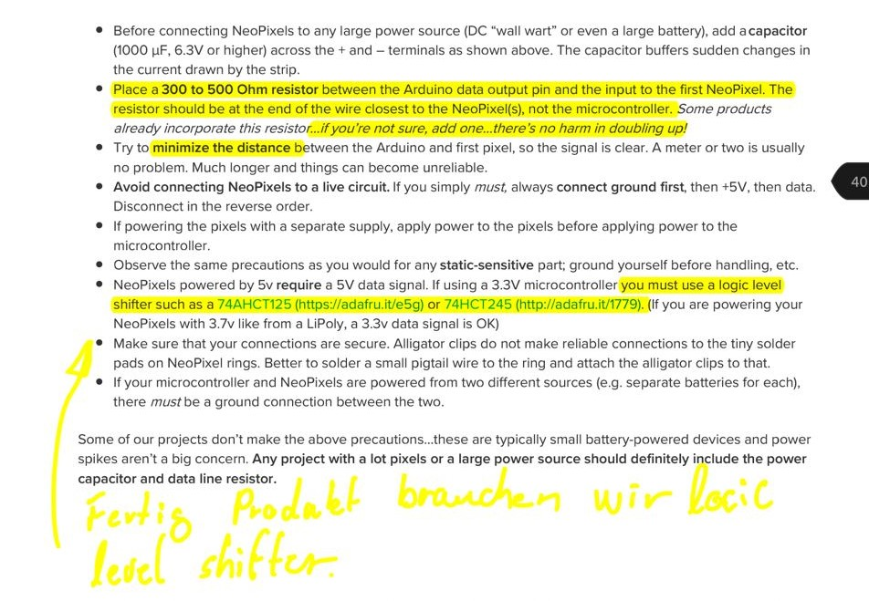
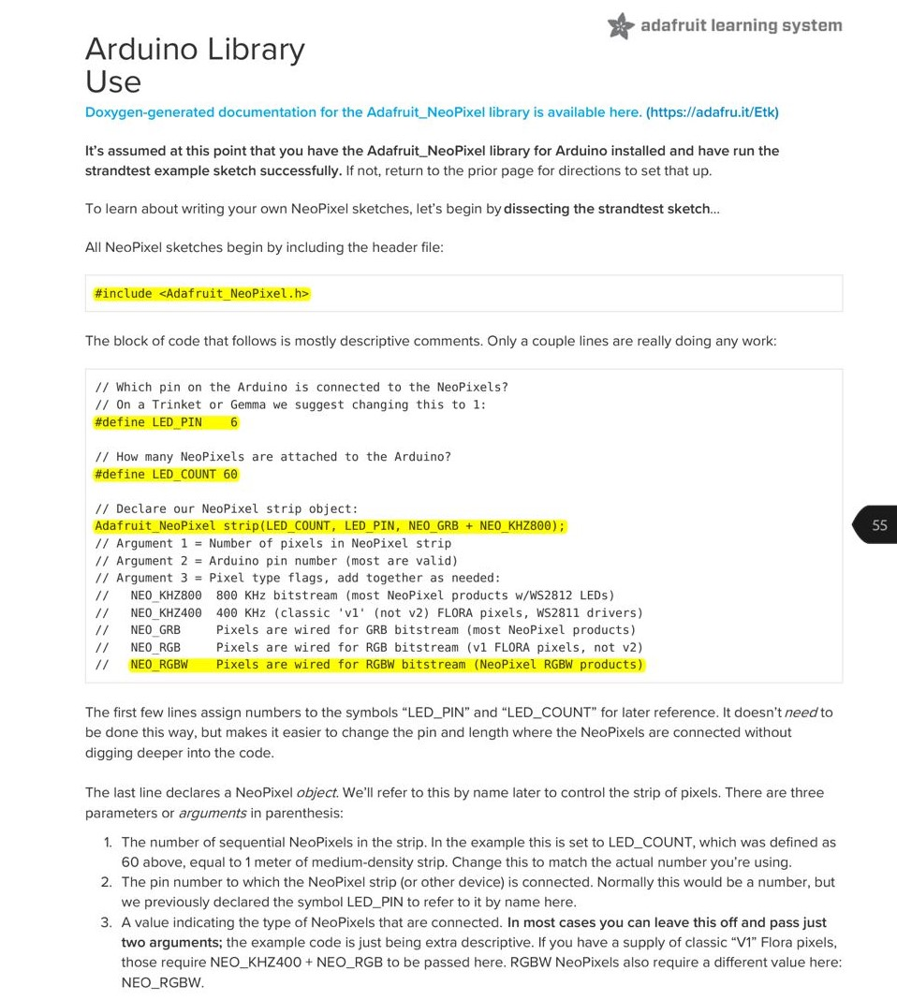
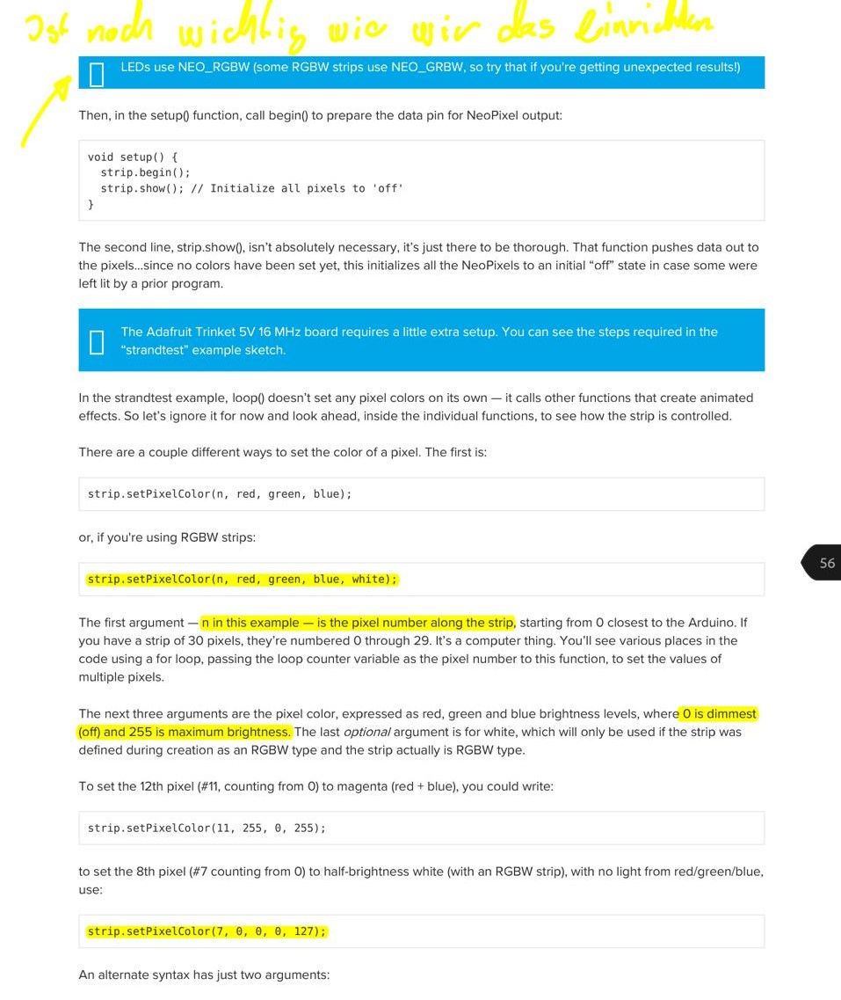
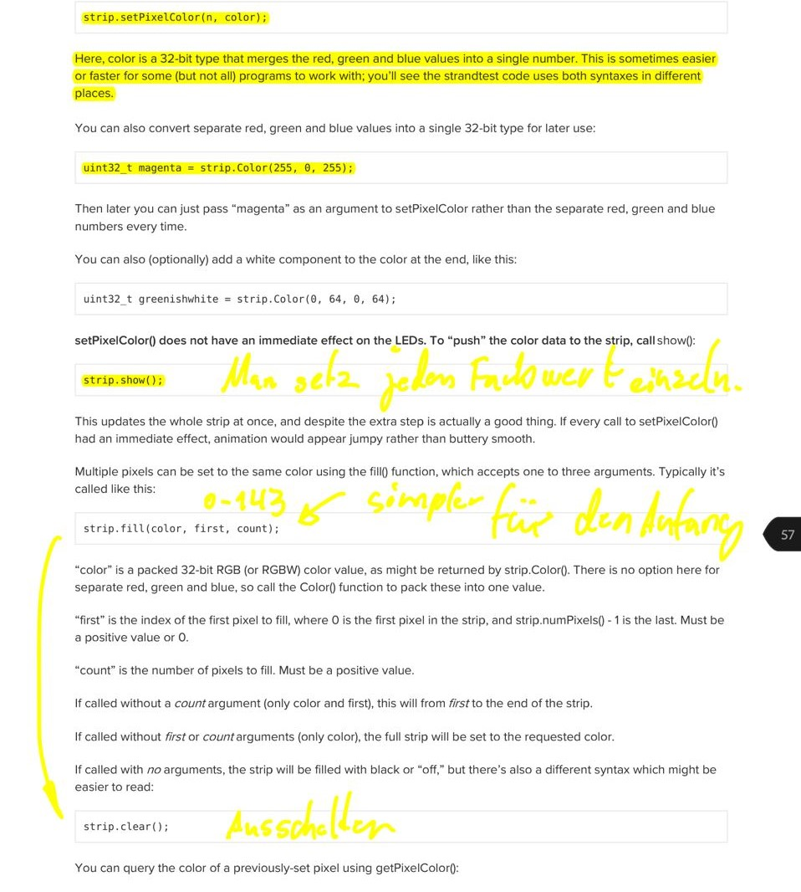

# winkellampe

## MPU6050

Hersteller: TDK InvenSense Japan

Link: [MPU6050](https://invensense.tdk.com/products/motion-tracking/6-axis/mpu-6050/)

MPU-6050 Six-Axis Gyro + Accelerometer MEMS MotionTracking™ Devices

Beschleunigungssensor (ACC) und einen Drehratensensor (GYRO)

DMP Digital Motion Processor

[dmp-data-from-i2cdevlib](http://www.geekmomprojects.com/mpu-6050-dmp-data-from-i2cdevlib/)

---

### 📕 LIB

**Liblink:** [MPU6050_light](https://github.com/rfetick/MPU6050_light) *License:MIT*

> [!IMPORTANT]
> Funktioniert nur mit Arduino. ESP funktioniert leider nicht.

**🔽 Lösung für Winkle Problem + Schift**

- Man kann sich aus der Funktion raus hollen wie werden Komplementäre gefiltert werden
- Es stabelesiert die Werte
- Kalibriert die Werte

Die MPU6050_light 📕LIB basiert auf der [MPU6050_tockn](https://github.com/Titibo26/MPU6050_tockn) 📕LIB aus den Unterschieden mit der [Adafruit_MPU6050](https://github.com/adafruit/Adafruit_MPU6050) 📕LIB sind eine gute Vorlage.

**Experiment:** [MPU6050_winkle2.ino](skript/MPU6050_winkel2/MPU6050_winkel2.ino)


**Filter:** Der Sensor misst mehrfach alle Position und nimmt den durchschnitt mit den DMP. Wen man aber nur den Gyro als Referenz nimmt funktioniert das nur über kurze Zeit. Jeder Messpunkt den man addiert bringt ungenauigkeit ins System wo der Ausgangspunkt ist von den Orientierungssystem weil sich jede Messungenaugikeit überträgt.

Die Sensor Daten werden durch die 📕Lib durch einen [Komplementäre Filter](https://www.youtube.com/watch?v=whSw42XddsU) geschickt um sauber Ergebnisse zu erhalten.

Komplementäre Filter ist ein High und Low-Passfilter kompiniert und Stabelesiert so das System. Highpass Filter wird für die Gyro-Daten benutzt da diese genau sind über kurze Zeit und der Low Passfilter wird für die Beschleunigung benutzt. Bei der Beschleunigung nutzt man die Fallbeschleunigung etwa 9,81 m/s² = g. g ist eine vektorielle Größe mit Betrag und Richtung, diese Richtung wirkt wie ein Lot in unseren System was den Gyro Stabelesiert.



In der MPU6050_light 📕LIB wird wie in den Video der selbe Korrekturverhältnis benutzt.

```
accCoef = 1.0-DEFAULT_GYRO_COEFF; = 0.98
gyroCoef = DEFAULT_GYRO_COEFF; = 0.02
```

> [!NOTE]
> Korrekturverhältnis könnte man benutzten um die Anfangsposition zu finden. Lampe befindet sich in Ruhelage beim anschalten, kein Kräft aus g wirken auf die Lampe. Aus g lässt sich der Winkle zum Boden bestimmen und somit der Anfangszustand.


🥼 Auf Koreanisch erklärt [Komplementäre Filter Lösung + Beispiel Skript + Kalman-Filter](https://blog.naver.com/ysahn2k/221385063966)

└> In den Arduino Skript ist alles mega gut zusammengefasst.

```
Calculate Pitch, Roll & Yaw by Complementary Filter
Reference is http://www.geekmomprojects.com/gyroscopes-and-accelerometers-on-a-chip/
Filtered Angle = α × (Gyroscope Angle) + (1 − α) × (Accelerometer Angle)     
where α = τ/(τ + Δt)   and   (Gyroscope Angle) = (Last Measured Filtered Angle) + ω×Δt
Δt = sampling rate, τ = time constant greater than timescale of typical accelerometer noise
```

└> Sogar mit Latenzen die Verschieden Methoden haben.

```
  Wire.write(0x1A);  // DLPF_CFG register
  Wire.write(0x00);     // Accel BW 260Hz, Delay 0ms / Gyro BW 256Hz, Delay 0.98ms, Fs 8KHz 
  //Wire.write(0x01);     // Accel BW 184Hz, Delay 2ms / Gyro BW 188Hz, Delay 1.9ms, Fs 1KHz 
  //Wire.write(0x02);     // Accel BW 94Hz, Delay 3ms / Gyro BW 98Hz, Delay 2.8ms, Fs 1KHz 
  //Wire.write(0x03);     // Accel BW 44Hz, Delay 4.9ms / Gyro BW 42Hz, Delay 4.8ms, Fs 1KHz 
  //Wire.write(0x04);     // Accel BW 21Hz, Delay 8.5ms / Gyro BW 20Hz, Delay 8.3ms, Fs 1KHz 
  //Wire.write(0x05);     // Accel BW 10Hz, Delay 13.8ms / Gyro BW 10Hz, Delay 13.4ms, Fs 1KHz 
  //Wire.write(0x06);     // Accel BW 5Hz, Delay 19ms / Gyro BW 5Hz, Delay 18.6ms, Fs 1KHz 
```


### Sensor Data



**AccelerometerRange:** Sensor kann bei verschieden Kraft einflüssen messen.

```
MPU6050_RANGE_2_G = 0b00,  ///< +/- 2g (default value)
MPU6050_RANGE_4_G = 0b01,  ///< +/- 4g
MPU6050_RANGE_8_G = 0b10,  ///< +/- 8g
MPU6050_RANGE_16_G = 0b11, ///< +/- 16g
```

*Standart:*
- MPU6050_light 📕LIB = MPU6050_ACCEL_CONFIG_0 = 0x00 // range = +- 2 g
- MPU6050_tockn 📕LIB = MPU6050_ACCEL_CONFIG = 0x1c


**GyroRange:**

```
MPU6050_RANGE_250_DEG,  ///< +/- 250 deg/s (default value)
MPU6050_RANGE_500_DEG,  ///< +/- 500 deg/s
MPU6050_RANGE_1000_DEG, ///< +/- 1000 deg/s
MPU6050_RANGE_2000_DEG, ///< +/- 2000 deg/s
```

Verschieden 📕Lib Nutzen da unterschiedliche Genaugikeiten.

**FilterBandwidth**

Der Sensor hat Digital Motion Processing™ DMP™ damit kann man die Wert vorher schon Stabelesieren.

```
MPU6050_BAND_260_HZ, ///< Docs imply this disables the filter
MPU6050_BAND_184_HZ, ///< 184 Hz
MPU6050_BAND_94_HZ,  ///< 94 Hz
MPU6050_BAND_44_HZ,  ///< 44 Hz
MPU6050_BAND_21_HZ,  ///< 21 Hz
MPU6050_BAND_10_HZ,  ///< 10 Hz
MPU6050_BAND_5_HZ,   ///< 5 Hz
```

---


### 🔨 Funktion

**MPU6050thisIsFlat:**

- kalibriert den Sensor in Moment der Messung das die Position in der er sich befindet Flach ist.

> [!TIP]
> In zusammen gebauten Produkt sollte diese Position in einer Funktion manual gesetzt werden da bei jeden An und Ausschalten der Cache weg geht. ``setGyroOffsets(gx,gy,gz)``

---

# LED-SK6812

Quelle: [adafruit-neopixel-uberguide](https://cdn-learn.adafruit.com/downloads/pdf/adafruit-neopixel-uberguide.pdf)













